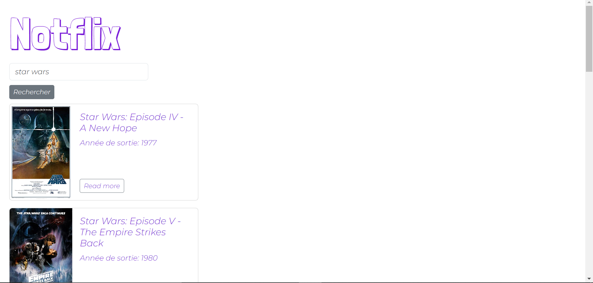
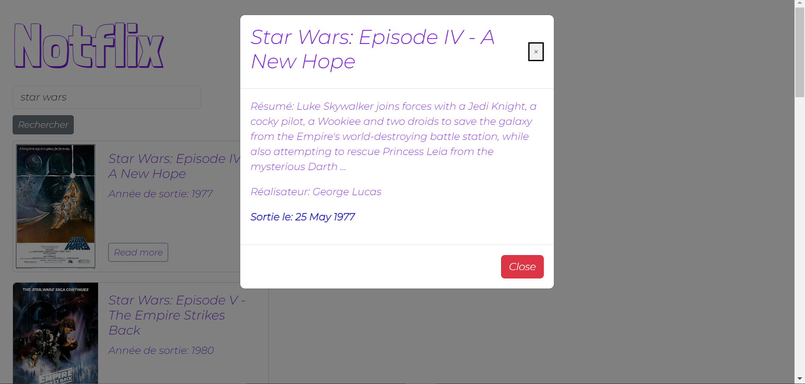

## (Petit) exercice Javascript 
 
- Mission : Afficher une liste de films  
- Api utilisé: <a href="https://www.omdbapi.com/">OMDb API</a>

Le site web affiche la liste de films correspondants à la recherche de l'utilisateur. Il affichera également les informations sur un film si l'utilisateur clique dessus. 

    

Pop-up lors de l'éxécution du bouton "read more"

    

 Ciao 	&#129302;

